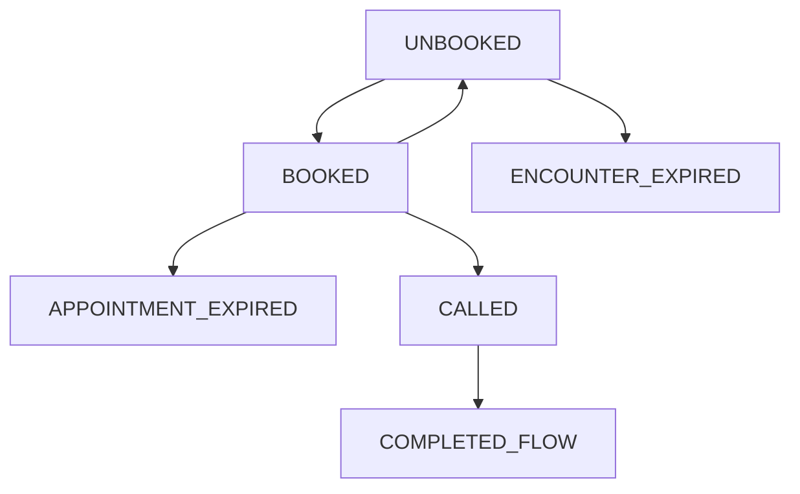

**Currently: implemented**

This WIP document defines the current phases of the lifetime of an encounter from *the perspective of the siyo.clinic web*. In addition, it defines what events (see [[Events]]) may be emitted during each phase.
## What is a phase?
An encounter's lifetime is divided into a series of phases. Each phase represents a "milestone" in the encounter state, used primarily for debugging and business purposes. Phases do NOT capture a patient's visit to the website (so thus onetime verification is not a phase); they capture *important high-level aspects of the encoutner state*. Importance indicates that the state is important for debugging or business. These states can be triggered by both patient actions and system events (such as the encounter expiring). Most of these phases will also be important from the doctor's perspective, and could be displayed in a sort of high-level dashboard to the doctor. 
## Lifetime diagram
Here is the current lifetime diagram:

## Phases
Also includes the possible events emitted in each phase. A question mark (?) by an event means it is a decision made with very low confidence; highly tentative. 
#### UNBOOKED
- Initial state of the encounter code. 
- Indicates that the patient has no appointment booked. The encounter's associated appointment should be null.
- **Possible events:**
	- USER:
		- VERIFICATION_SENT
		- VERIFIED
		- TOS_VIEWED
		- TOS_ACCEPTED
		- TOS_REJECTED
		- APPOINTMENTS_VIEWED
		- APPOINTMENT_BOOKED
	- SYSTEM_FUH_REQUEST:
		- FUH_GET_ENCOUNTER
		- FUH_GET_TIMESLOTS
		- FUH_BOOK_APPOINTMENT
		- FUH_SET_TOS (?)
	- SYSTEM_INTERNAL: *none*
#### BOOKED
- Indicates that the user has a booked appointment. The encounter's associated appointment should be non-null.
- **Possible events:**
	- USER:
		- VERIFICATION_SENT
		- VERIFIED
		- TOS_VIEWED (?)
		- TOS_ACCEPTED (?)
		- TOS_REJECTED (?)
		- APPOINTMENTS_VIEWED
		- APPOINTMENT_CANCELLED
		- JOINED_CALL
	- SYSTEM_FUH_REQUEST:
		- FUH_GET_ENCOUNTER
		- FUH_GET_TIMESLOTS
		- FUH_CANCEL_APPOINTMENT
		- FUH_SET_TOS (?)
	- SYSTEM_INTERNAL: *none*
#### CALLED
- Indicates that the patient has successfully began their booked video call. 
- **In this stage, the patient may leave and rejoin the call any number of times. See discussion below.**
- **Possible events:**
	- USER:
		- VERIFICATION_SENT
		- VERIFIED
		- TOS_VIEWED (?)
		- TOS_ACCEPTED (?)
		- TOS_REJECTED (?)
		- LEFT_CALL
		- JOINED_CALL
	- SYSTEM_FUH_REQUEST:
		- FUH_GET_ENCOUNTER 
		- FUH_GET_TIMESLOTS (?)
		- FUH_SET_TOS (?)
	- SYSTEM_INTERNAL: *none*
#### COMPLETED_FLOW
- This phase indicates a successful termination of the encounter. Thus, the patient has booked an appointment, joined the call, and left the call. No actions can be taken after this point. It is the end of the "happy path."
- **Possible events:**
	- USER: 
		- VERIFICATION_SENT (?)
		- VERIFIED (?)
		- TOS_VIEWED
		- TOS_ACCEPTED
		- TOS_REJECTED
		- APPOINTMENTS_VIEWED (?)
	- SYSTEM_FUH_REQUEST:
		- FUH_GET_ENCOUNTER
		- FUH_GET_TIMESLOTS (?)
		- FUH_SET_TOS
	- SYSTEM_INTERNAL: *none* (?)
#### APPOINTMENT_EXPIRED
- This phase indicates the patient has lost access to the video session of the appointment booked due to their appointment access expiring (currently 10 hours). No actions can be taken past this point.
- This is different from `ENCOUNTER_EXPIRED`, which indicates the patient has not booked an appointment before the encounter's expiration date.
- See also discussion below. 
- **Possible events:**
	- USER: 
		- VERIFICATION_SENT (?)
		- VERIFIED (?)
		- TOS_VIEWED
		- TOS_ACCEPTED
		- TOS_REJECTED
		- APPOINTMENTS_VIEWED (?)
	- SYSTEM_FUH_REQUEST:
		- FUH_GET_ENCOUNTER
		- FUH_GET_TIMESLOTS (?)
		- FUH_SET_TOS
	- SYSTEM_INTERNAL: *none* (?)
#### ENCOUNTER_EXPIRED
- This phase indicates the encounter itself has expired before the patient has booked an appointment. No actions can be taken past this point.
- This is different from `APPIONTMENT_EXPIRED`, where the patient books an appointment and does not join the call. The patient then loses access to the video session after a certain amount of time (currently 10 hours).
- See also discussion below
- **Possible events:**
	- USER: *none* (?)
	- SYSTEM_FUH_REQUEST: *none* (?)
	- SYSTEM_INTERNAL: *none* (?)
## Questions to discuss/consider for future updates:
- **Should the user be able to accept/reject tos mid-lifetime?** If so, what state should the user be in?
- **Should we include a `TERMS_OF_SERVICE`-based phase?** I did not because I do not think that type of phase belongs to the lifetime of the encounter code, as the terms of service is connected to the patient rather than a specific encounter. See above question.
- **What events (many of which will result in failure) should be sent in the \*\_EXPIRED phases?** Verification? What about TOS? Perhaps the user can request for timeslots, but result in an error?
- **Should we get rid of the `CALLED` phase and instead switch to `JOINED_CALL` and `LEFT_CALL` stages?** This would be a little more difficult to track and more complex. However, it might have added benefit for debugging. I did not include these phases since we already have `JOINED_CALL` and `LEFT_CALL` events.
- **Should we separate  `UNBOOKED` into three stages: `INIT`, `APPOINTMENTS_VIEWED` and `CANCELLED`, or something similar?** `INIT` (the new initial state) would transition to `APPOINTMENTS_VIEWED` once the patient viewed a page of appointments. `APPOINTMENTS_VIEWED` and `CANCELLED`  would have the same transitions and very similar semantics. The only difference is that `APPOINTMENTS_VIEWED` indicates a first-time entry to that stage, while `CANCELLED` indicates that it has previously been in the `APPOINTMENTS_VIEWED` stage. So, if the user views the appointments (thus goes into `APPOINTMENTS_VIEWED` from the `INIT` stage), books an appointment (--> `BOOKED`), and cancels that appointment, they would transition to `CANCELLED` instead of `UNBOOKED`. The potential benefit would be for debugging purposes. It might be easier to debug with separate phases. I did not include this as it would increase complexity both of the event flow and the implementation. 
- **Should we combine `APPOINTMENT_EXPIRED` and `ENCOUNTER_EXPIRED`?** They have similar semantics, both indicating that the encounter unsuccessfully terminated. I separated them into two phases because they can indicate a separate action from the patient side (in one, they didn't book the appointment; in the other, they booked the appointment but never joined the call). Both indicate expiration, but the *reason* for expiration is different.
- **Would there ever be a case where the encounter expires before the appointment?** If so, we will need to add a transition from `APPOINTMENT_BOOKED` to `ENCOUNTER_EXPIRED`.

